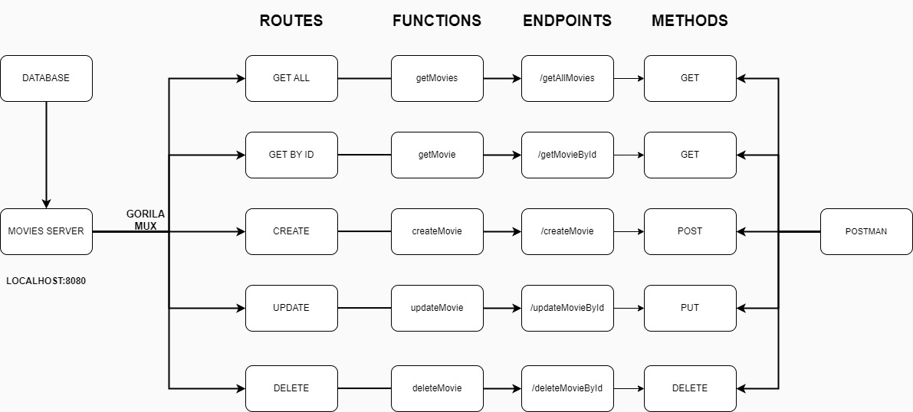

# Projeto de Gerenciamento de Filmes

Este é um projeto simples para um sistema de gerenciamento de filmes usando Go e o framework Gorilla Mux.

Voltado totalmente para fins de estudos de arquitetura e construção de API em Go.

## Funcionalidades

- **Adicionar Filme**: Adiciona um novo filme ao sistema.
- **Deletar Filme**: Remove um filme do sistema.
- **Listar Todos os Filmes**: Retorna uma lista de todos os filmes no sistema.
- **Atualizar Filme**: A fazer

## Endpoints

- `POST /addMovie`: Adiciona um novo filme.
- `DELETE /deleteMovie`: Deleta um filme existente por ID.
- `GET /getAllMovies`: Retorna todos os filmes.

## Estrutura de Pastas do Projeto

```plaintext
.
├── adapters
    ├── http
        ├── movieService
    ├── postgres
        ├── movieRepository
├── core
    ├── domain
        ├── usecase
    ├── dto    
├── database
    ├── migrations
├── di

```

## Desenho de arquitetura do projeto

